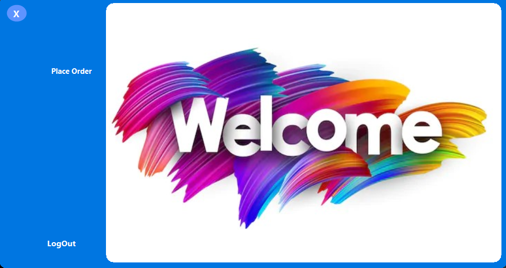

# Cafe Management System Documentation

## Table of Contents

1\. Introduction

2\. User Roles

   - 2.1 Guest User

   - 2.2 Admin User

3\. Guest User Features

   - 3.1 Place Order

   - 3.2 Print Receipt

4\. Admin User Features

   - 4.1 Place Order

   - 4.2 Print Receipt

   - 4.3 Manage Categories

      - 4.3.1 Add Category

      - 4.3.2 Update Category

      - 4.3.3 Delete Category

   - 4.4 Manage Items

      - 4.4.1 Add Item

      - 4.4.2 Update Item

      - 4.4.3 Delete Item

5\. Technology Stack

6\. Contact Information

## 1. Introduction

The Cafe Management System is a Windows Forms application developed in C# to efficiently manage cafe operations. The system caters to both Guest and Admin users, offering a seamless experience for placing orders, managing categories and items, and generating receipts.

## 2. User Roles

### Login

Admin users must log in using a username and password to access the admin functionalities. And Gust can go to dashboard from " Continue as Guest "

### 2.1 Guest User

Guest users do not need to log in to the system. They can place orders and receive a printed receipt after ordering.

### Dashboard

### 2.2 Admin User

Admin users need to log in using a valid username and password to access additional functionalities for managing categories, items, and placing orders.

## 3. Guest User Features

### 3.1 Place Order

Guest users can browse the menu, select items, and place orders without the need for authentication.

### 3.2 Print Receipt

After placing an order, guest users can print a receipt for their records.

## 4. Admin User Features

### 4.1 Place Order

Admin users can place orders similar to guest users, with additional administrative capabilities.

### 4.2 Print Receipt

Admin users can print receipts for orders they have placed.

### 4.3 Manage Categories

#### 4.3.1 Add Category

Admin users can add new categories to the menu.

#### 4.3.2 Update Category

Admin users can update existing category information.

#### 4.3.3 Delete Category

Admin users can delete categories from the system.

### 4.4 Manage Items

#### 4.4.1 Add Item

Admin users can add new items to the menu.

#### 4.4.2 Update Item

Admin users can update existing item information.

#### 4.4.3 Delete Item

Admin users can delete items from the system.

## 5. Technology Stack

The Cafe Management System is built using the following technologies:

- C# Windows Forms: The application framework for building the Windows-based user interface.

## 6. Contact Information

For further assistance, please contact me at raisulislamniloy47@gmail.com.